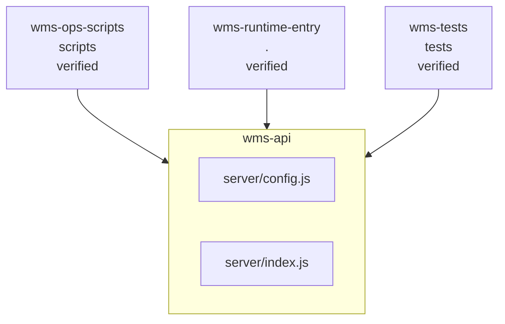

<!-- KAAF-GENERATED — do not edit by hand. Regenerate with scripts/architecture/generate.sh. -->

# Component — wms-api (C4 L3)

`wms-api` at `server` — confidence `verified`. 2 declared public entry point(s), 0 dependency(ies), 3 dependent(s).

**Reading this diagram**

- Solid arrow: a dependency declared in a `kaaf.module.json` manifest.
- Dotted arrow: a real import discovered in the source that no manifest declares — see `.ai/drift.json`.
- Node outline reflects confidence: solid = `verified`, dashed = `documented` or `derived`.
<!-- kaaf:bodyDigest=230fe61f1381b91198d2df2fb59694127f94e1993e9d574b9ba5f891974a0b46 -->
