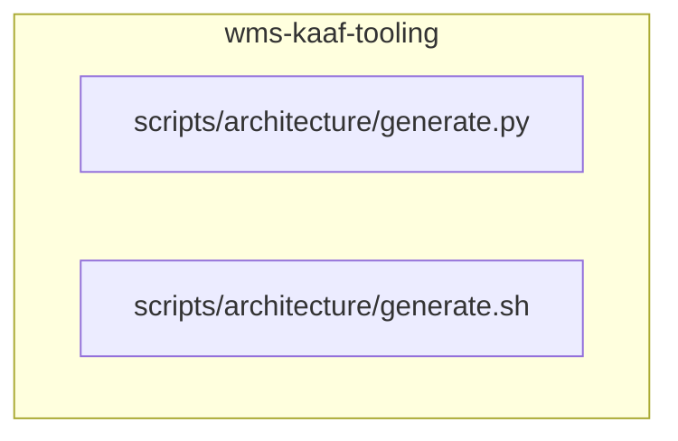

<!-- KAAF-GENERATED — do not edit by hand. Regenerate with scripts/architecture/generate.sh. -->

# Component — wms-kaaf-tooling (C4 L3)

`wms-kaaf-tooling` at `scripts/architecture` — confidence `verified`. 2 declared public entry point(s), 0 dependency(ies), 0 dependent(s).

**Reading this diagram**

- Solid arrow: a dependency declared in a `kaaf.module.json` manifest.
- Dotted arrow: a real import discovered in the source that no manifest declares — see `.ai/drift.json`.
- Node outline reflects confidence: solid = `verified`, dashed = `documented` or `derived`.
<!-- kaaf:bodyDigest=130c39a4ae8bb2d4b63bce8ae3d6f1807e9a7d3ece01d323c006d408f8a4456b -->
