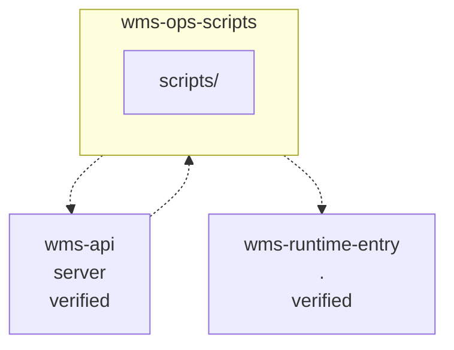

<!-- KAAF-GENERATED — do not edit by hand. Regenerate with scripts/architecture/generate.sh. -->

# Component — wms-ops-scripts (C4 L3)

`wms-ops-scripts` at `scripts` — confidence `verified`. 1 declared public entry point(s), 2 dependency(ies), 1 dependent(s).

**Reading this diagram**

- Solid arrow: a dependency declared in a `kaaf.module.json` manifest.
- Dotted arrow: a real import discovered in the source that no manifest declares — see `.ai/drift.json`.
- Node outline reflects confidence: solid = `verified`, dashed = `documented` or `derived`.
<!-- kaaf:bodyDigest=d037e05a360d566dc9c6b87f0338175f527ef9d7fb56caaad1de64c151969368 -->
