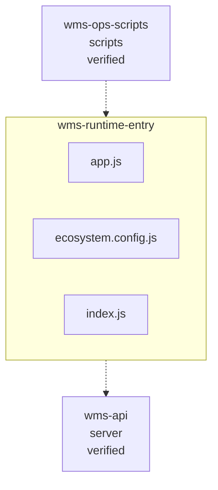

<!-- KAAF-GENERATED — do not edit by hand. Regenerate with scripts/architecture/generate.sh. -->

# Component — wms-runtime-entry (C4 L3)

`wms-runtime-entry` at `.` — confidence `verified`. 3 declared public entry point(s), 1 dependency(ies), 1 dependent(s).

**Reading this diagram**

- Solid arrow: a dependency declared in a `kaaf.module.json` manifest.
- Dotted arrow: a real import discovered in the source that no manifest declares — see `.ai/drift.json`.
- Node outline reflects confidence: solid = `verified`, dashed = `documented` or `derived`.
<!-- kaaf:bodyDigest=55f8a4d36db35d4d58168239c9877668cbebf73bd5739a0c90930defd1e5a52e -->
