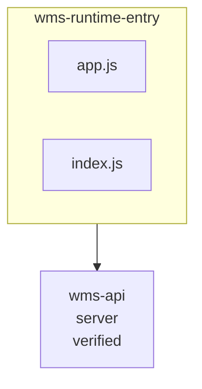

<!-- KAAF-GENERATED — do not edit by hand. Regenerate with scripts/architecture/generate.sh. -->

# Component — wms-runtime-entry (C4 L3)

`wms-runtime-entry` at `.` — confidence `verified`. 2 declared public entry point(s), 1 dependency(ies), 0 dependent(s).

**Reading this diagram**

- Solid arrow: a dependency declared in a `kaaf.module.json` manifest.
- Dotted arrow: a real import discovered in the source that no manifest declares — see `.ai/drift.json`.
- Node outline reflects confidence: solid = `verified`, dashed = `documented` or `derived`.
<!-- kaaf:bodyDigest=41c8c1e86547dbeb3f5f3980ea7dab9c5005a5381e71852590376fff7d3035f7 -->
