<!-- KAAF-GENERATED — do not edit by hand. Regenerate with scripts/architecture/generate.sh. -->

# Context (C4 L1)

What WMS is and what it depends on. 6 external integration(s).

```mermaid
graph TB
  WMS["WMS<br/>Islamce/WMS"]
  subgraph external[External systems]
    ext_Caddy_central_proxy_at_opt_proxy_external_Docker_network_web["Caddy &#40;central proxy at /opt/proxy, external Docker network `web`&#41;<br/>reverse-proxy<br/>required"]
    ext_Docker_Compose_service_wms_opt_apps_wms_docker_compose_yml["Docker Compose &#40;service `wms`, /opt/apps/wms/docker-compose.yml&#41;<br/>process-manager<br/>required"]
    ext_Firebase_Cloud_Messaging["Firebase Cloud Messaging<br/>push-notification<br/>optional"]
    ext_Firebase_Cloud_Messaging_firebase_admin["Firebase Cloud Messaging &#40;firebase-admin&#41;<br/>push-notification<br/>optional"]
    ext_SQLite_via_better_sqlite3["SQLite via better-sqlite3<br/>database<br/>required"]
    ext_WMS_API["WMS API<br/>http-api<br/>required"]
  end
  WMS -->|via wms-runtime-entry| ext_Caddy_central_proxy_at_opt_proxy_external_Docker_network_web
  WMS -->|via wms-runtime-entry| ext_Docker_Compose_service_wms_opt_apps_wms_docker_compose_yml
  WMS -->|via wms-mobile| ext_Firebase_Cloud_Messaging
  WMS -->|via wms-api| ext_Firebase_Cloud_Messaging_firebase_admin
  WMS -->|via wms-api| ext_SQLite_via_better_sqlite3
  WMS -->|via wms-mobile| ext_WMS_API
```

<!-- kaaf:bodyDigest=338f1f85c11e96db79d5f55836bde52fcd9c20cf5f988e419726582e0a9e5c23 -->
