<!-- KAAF-GENERATED — do not edit by hand. Regenerate with scripts/architecture/generate.sh. -->

# Context (C4 L1)

What WMS is and what it depends on. 5 external integration(s).

```mermaid
graph TB
  WMS["WMS<br/>Islamce/WMS"]
  subgraph external[External systems]
    ext_Firebase_Cloud_Messaging["Firebase Cloud Messaging<br/>push-notification<br/>optional"]
    ext_Firebase_Cloud_Messaging_firebase_admin["Firebase Cloud Messaging &#40;firebase-admin&#41;<br/>push-notification<br/>optional"]
    ext_Phusion_Passenger_PM2["Phusion Passenger / PM2<br/>process-manager<br/>required"]
    ext_SQLite_via_better_sqlite3["SQLite via better-sqlite3<br/>database<br/>required"]
    ext_WMS_API["WMS API<br/>http-api<br/>required"]
  end
  WMS -->|via wms-mobile| ext_Firebase_Cloud_Messaging
  WMS -->|via wms-api| ext_Firebase_Cloud_Messaging_firebase_admin
  WMS -->|via wms-runtime-entry| ext_Phusion_Passenger_PM2
  WMS -->|via wms-api| ext_SQLite_via_better_sqlite3
  WMS -->|via wms-mobile| ext_WMS_API
```

<!-- kaaf:bodyDigest=65476007408d0bd4a39ed104cca0b84cbe0541bfeb41782519c33b9593d9f998 -->
