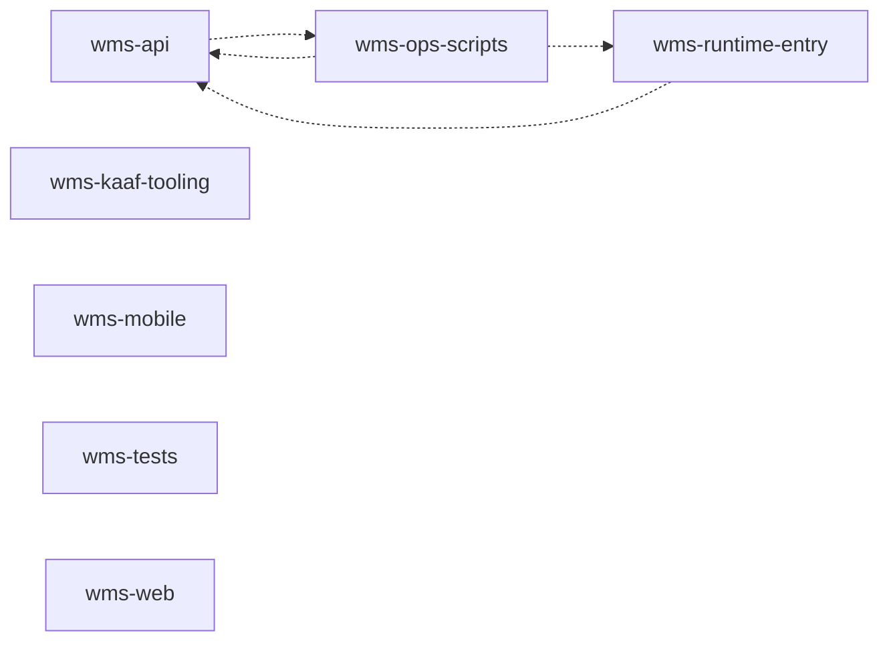

<!-- KAAF-GENERATED — do not edit by hand. Regenerate with scripts/architecture/generate.sh. -->

# WMS — Architecture Summary

WMS - a warehouse management system with a Node.js backend, a browser client, and a Flutter mobile application.

- Repository: `Islamce/WMS`
- Default branch: `main`
- KAAF phase: 7
- Modules: 7 declared, 0 discovered only
- Drift: 5 error, 0 warning, 0 info
- Generator: `kaaf` v0.7.0
- Input digest: `8f5f19c1b46bdc9b…`

## Modules

Confidence is computed from evidence, not copied from the manifest: `verified` =
declared and corroborated by discovered code, `documented` = declared with no code to
check against, `derived` = discovered with no declaration.

| Module | Path | Owner | Purpose | Confidence |
|---|---|---|---|---|
| `wms-api` | `server` | Backend | Serve every warehouse operation over HTTP - materials, stock, receiving, picking, shipping, requests, approvals, cycle counts, locations, analytics and administration - and enforce database-defined permissions on each. | `verified` |
| `wms-kaaf-tooling` | `scripts/architecture` | DevOps | Generate and validate this repository's KAAF architecture context. Vendored from Islamce/KAAF; see VENDORED.md before changing anything here. | `verified` |
| `wms-mobile` | `wms flutter application` | Mobile | Provide the Flutter mobile client (wms_mobile) for warehouse floor operations - scanning, picking, counting, requests and approvals - against the WMS API. | `verified` |
| `wms-ops-scripts` | `scripts` | DevOps | Operational and maintenance scripts. Several are destructive or production-affecting; CLAUDE.md forbids running seed, reset or fresh-start operations in production and is authoritative over this manifest. | `verified` |
| `wms-runtime-entry` | `.` | DevOps | Boot the production process under the managed host. Production path, runtime path and required environment flags are defined in CLAUDE.md and are authoritative over this manifest. | `verified` |
| `wms-tests` | `tests` | QA | End-to-end, smoke and load suites, including the executable regression tests that pin the fail-closed auto-seed rule established after the 2026-07-25 production database incident. | `verified` |
| `wms-web` | `public` | Frontend | Present the warehouse operations interface in the browser, served as static assets by the API process. | `verified` |

## Dependencies

Solid edges are declared in the manifests. Dotted edges were discovered from real
imports but are not declared — see the drift section below.

## Public contracts

| Contract | Kind | Module | Path | Stability |
|---|---|---|---|---|
| `wms-admin-routes` | rest | `wms-api` | `server/routes/admin.js` | evolving |
| `wms-analytics-routes` | rest | `wms-api` | `server/routes/analytics.js` | evolving |
| `wms-approvals-routes` | rest | `wms-api` | `server/routes/approvals.js` | evolving |
| `wms-attachments-routes` | rest | `wms-api` | `server/routes/attachments.js` | evolving |
| `wms-auth-routes` | rest | `wms-api` | `server/routes/auth.js` | evolving |
| `wms-cycleCount-routes` | rest | `wms-api` | `server/routes/cycleCount.js` | evolving |
| `wms-dashboard-routes` | rest | `wms-api` | `server/routes/dashboard.js` | evolving |
| `wms-erpOperator-routes` | rest | `wms-api` | `server/routes/erpOperator.js` | evolving |
| `wms-export-routes` | rest | `wms-api` | `server/routes/export.js` | evolving |
| `wms-gi-routes` | rest | `wms-api` | `server/routes/gi.js` | evolving |
| `wms-import-routes` | rest | `wms-api` | `server/routes/import.js` | evolving |
| `wms-inventory-routes` | rest | `wms-api` | `server/routes/inventory.js` | evolving |
| `wms-kpi-routes` | rest | `wms-api` | `server/routes/kpi.js` | evolving |
| `wms-locations-routes` | rest | `wms-api` | `server/routes/locations.js` | evolving |
| `wms-masterdata-routes` | rest | `wms-api` | `server/routes/masterdata.js` | evolving |
| `wms-materials-routes` | rest | `wms-api` | `server/routes/materials.js` | evolving |
| `wms-meta-routes` | rest | `wms-api` | `server/routes/meta.js` | evolving |
| `wms-notifications-routes` | rest | `wms-api` | `server/routes/notifications.js` | evolving |
| `wms-openingStockReconcile-routes` | rest | `wms-api` | `server/routes/openingStockReconcile.js` | evolving |
| `wms-permissions-routes` | rest | `wms-api` | `server/routes/permissions.js` | evolving |
| `wms-picking-routes` | rest | `wms-api` | `server/routes/picking.js` | evolving |
| `wms-reallocation-routes` | rest | `wms-api` | `server/routes/reallocation.js` | evolving |
| `wms-receiving-routes` | rest | `wms-api` | `server/routes/receiving.js` | evolving |
| `wms-requests-routes` | rest | `wms-api` | `server/routes/requests.js` | evolving |
| `wms-shipping-routes` | rest | `wms-api` | `server/routes/shipping.js` | evolving |
| `wms-stock-routes` | rest | `wms-api` | `server/routes/stock.js` | evolving |
| `wms-users-routes` | rest | `wms-api` | `server/routes/users.js` | evolving |
| `wms-warehouse-routes` | rest | `wms-api` | `server/routes/warehouse.js` | evolving |

## Permissions

| Key | Module | Roles | Enforced at |
|---|---|---|---|
| `wms.ai_analytics` | `wms-api` | database-defined | `server/middleware/auth.js`, `server/routes/analytics.js` |
| `wms.all_locations` | `wms-api` | database-defined | `server/middleware/auth.js`, `server/routes/locations.js` |
| `wms.approvals` | `wms-api` | database-defined | `server/middleware/auth.js`, `server/routes/approvals.js` |
| `wms.audit_trail` | `wms-api` | database-defined | `server/middleware/auth.js`, `server/routes/masterdata.js` |
| `wms.bin_batch_assignment` | `wms-api` | database-defined | `server/middleware/auth.js`, `server/routes/reallocation.js`, `server/routes/warehouse.js` |
| `wms.bins_master` | `wms-api` | database-defined | `server/middleware/auth.js`, `server/routes/masterdata.js` |
| `wms.create_request` | `wms-api` | database-defined | `server/middleware/auth.js`, `server/routes/requests.js` |
| `wms.cycle_count` | `wms-api` | database-defined | `server/middleware/auth.js`, `server/routes/cycleCount.js` |
| `wms.dashboard` | `wms-api` | database-defined | `server/middleware/auth.js`, `server/routes/dashboard.js` |
| `wms.empty_locations` | `wms-api` | database-defined | `server/middleware/auth.js`, `server/routes/locations.js` |
| `wms.erp_operator` | `wms-api` | database-defined | `server/middleware/auth.js`, `server/routes/erpOperator.js` |
| `wms.expiry_alerts` | `wms-api` | database-defined | `server/middleware/auth.js`, `server/routes/masterdata.js` |
| `wms.gi_posting` | `wms-api` | database-defined | `server/middleware/auth.js`, `server/routes/gi.js` |
| `wms.goods_receipt` | `wms-api` | database-defined | `server/middleware/auth.js`, `server/routes/receiving.js` |
| `wms.kpi_dashboard` | `wms-api` | database-defined | `server/middleware/auth.js`, `server/routes/kpi.js` |
| `wms.locations` | `wms-api` | database-defined | `server/middleware/auth.js`, `server/routes/locations.js` |
| `wms.material_requests` | `wms-api` | database-defined | `server/middleware/auth.js`, `server/routes/requests.js` |
| `wms.materials` | `wms-api` | database-defined | `server/middleware/auth.js`, `server/routes/materials.js` |
| `wms.movement_types_master` | `wms-api` | database-defined | `server/middleware/auth.js`, `server/routes/masterdata.js` |
| `wms.permissions_management` | `wms-api` | database-defined | `server/middleware/auth.js`, `server/routes/permissions.js` |
| `wms.picker_assignment` | `wms-api` | database-defined | `server/middleware/auth.js`, `server/routes/warehouse.js` |
| `wms.picking` | `wms-api` | database-defined | `server/middleware/auth.js`, `server/routes/picking.js` |
| `wms.quality` | `wms-api` | database-defined | `server/middleware/auth.js`, `server/routes/masterdata.js` |
| `wms.reallocation` | `wms-api` | database-defined | `server/middleware/auth.js`, `server/routes/reallocation.js` |
| `wms.stock_in` | `wms-api` | database-defined | `server/middleware/auth.js`, `server/routes/stock.js` |
| `wms.stock_out` | `wms-api` | database-defined | `server/middleware/auth.js`, `server/routes/stock.js` |
| `wms.users_management` | `wms-api` | database-defined | `server/middleware/auth.js`, `server/routes/users.js` |
| `wms.warehouses_master` | `wms-api` | database-defined | `server/middleware/auth.js`, `server/routes/masterdata.js` |

## External integrations

| Integration | Module | Criticality | On unavailability |
|---|---|---|---|
| Firebase Cloud Messaging (firebase-admin) | `wms-api` | optional | Mobile push notifications are not delivered; in-app notification records are still written. |
| SQLite via better-sqlite3 | `wms-api` | required | The system cannot serve or record any warehouse operation. Production database path and safety invariants are defined in CLAUDE.md. |
| Firebase Cloud Messaging | `wms-mobile` | optional | Device push notifications are not received; in-app screens still function. |
| WMS API | `wms-mobile` | required | The mobile client cannot authenticate or perform any warehouse operation. |
| Phusion Passenger / PM2 | `wms-runtime-entry` | required | The production process is not supervised or restarted. |

## Drift — declared versus discovered

5 error, 0 warning, 0 info. Errors block CI; warnings and information do not.

| Severity | Type | Module | Finding |
|---|---|---|---|
| `error` | `discovered-import-cycle` | `wms-api` | Discovered imports form a cycle: wms-api -> wms-ops-scripts -> wms-api |
| `error` | `undeclared-dependency` | `wms-api` | 'wms-api' imports 'wms-ops-scripts' but does not declare the dependency. |
| `error` | `undeclared-dependency` | `wms-ops-scripts` | 'wms-ops-scripts' imports 'wms-api' but does not declare the dependency. |
| `error` | `undeclared-dependency` | `wms-ops-scripts` | 'wms-ops-scripts' imports 'wms-runtime-entry' but does not declare the dependency. |
| `error` | `undeclared-dependency` | `wms-runtime-entry` | 'wms-runtime-entry' imports 'wms-api' but does not declare the dependency. |

Full detail, with evidence and recommendations, in `.ai/drift.json`.

## How to use this

1. Read `.ai/ai-context.json` for the module index and conventions.
2. Read this summary for orientation.
3. Read `.ai/modules/<id>.json` for the module your task touches.
4. Check `.ai/drift.json` before trusting a declaration.
5. Open only the source files those steps referenced.

Declarations come from `kaaf.repo.json` and `kaaf.module.json`. Discovery is a static
read of the source: dynamic imports and runtime wiring are invisible to it, so the
absence of a drift finding is not proof that none exists.
<!-- kaaf:bodyDigest=2e5590c62c92b32ac97b73bdb1b970b7d0e4ac19d3aa1871ef509881bf2f0ce1 -->
